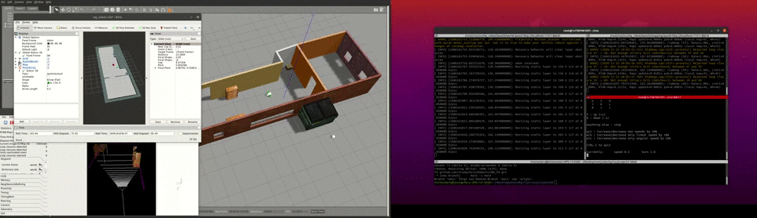

# Robotics Software Engineer

## Project 3 - Where Am I
 
Welcome to the Where Am I? localization project! In this project, you will learn to utilize ROS AMCL package to accurately localize a mobile robot inside a map in the Gazebo simulation environments.

Over the course of this lesson, you will learn several aspects of robotic software engineering with a focus on ROS:

- Create a ROS package that launches a custom robot model in a custom Gazebo world
- Utilize the ROS AMCL package and the Tele-Operation / Navigation Stack to localize the robot
- Explore, add, and tune specific parameters corresponding to each package to achieve the best possible localization results

Tasks: Where Am I Project

- [x] Set up simulation: environment and robot
- [x] Generate ground truth map from your Gazebo world
- [x] Build your AMCL launch file
- [x] Select proper localization parameters
- [x] Add teleop node
- [x] Put it all together
- [x] add simple wall detection

  

